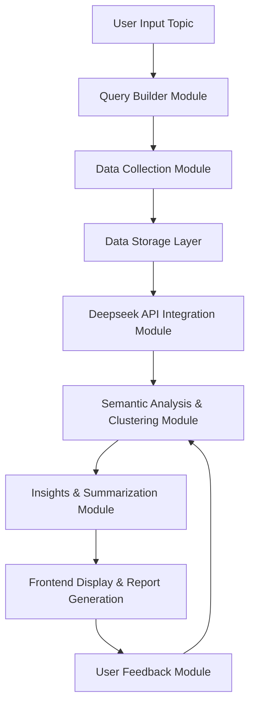

# Deepseek API Software Design Plan 🎯📊🧠

## 1. Overview

**Objective**: Build a multi-module system that starts with user input on a topic, collects multi-source data, processes it with Deepseek API for deep semantic understanding, and conducts subsequent NLP analysis and visualization to generate an in-depth research report. 📑📡💡

**System Architecture Diagram** (illustrative, can be detailed as needed):

---

## 2. Modules Design 🏗️🔍💾

### 1. Input & Query Builder Module 📝🔎✨
   - **Function**: Receives user input topics and expands queries (e.g., synonym expansion, semantic concept extraction) to create more comprehensive search requests.
   - **Technology**: Frontend (React/Streamlit) + Backend API (FastAPI/Flask); NLP preprocessing using libraries such as spaCy, NLTK.

### 2. Data Collection Module 🌍📡🗄️
   - **Function**: Fetches raw data related to the topic from multiple sources (Google, Bing, academic databases, social media, etc.).
   - **Considerations**: Ensure compliance with data source API policies and web scraping protocols (robots.txt).
   - **Technology**: Scrapy, requests, third-party APIs (e.g., SerpAPI); stores data in Elasticsearch or PostgreSQL.

### 3. Data Storage Layer 💾🔐🗂️
   - **Function**: Stores collected raw data and subsequent analysis results.
   - **Choices**:
     - **Full-text search**: Elasticsearch for efficient text queries and similarity searches.
     - **Structured data**: PostgreSQL for storing user information, logs, and feedback.

### 4. Deepseek API Integration Module 🔄🔬💡
   - **Function**: Calls Deepseek API for semantic embedding computation and similarity matching, filtering and ranking collected data.
   - **Technology**: Encapsulated API interface for communication with Deepseek services; includes rate limiting, error handling, and caching.

### 5. Semantic Analysis & Clustering Module 🧠📊🔍
   - **Function**:
     - Uses Deepseek-generated embedding vectors for clustering, topic modeling (e.g., LDA), and similarity analysis.
     - Performs summarization, sentiment analysis, and trend detection on the data.
   - **Technology**: Python data science stack (scikit-learn, gensim, UMAP/t-SNE for dimensionality reduction and visualization); Hugging Face Transformers for deep semantic analysis.

### 6. Insights & Summarization Module 📜📈🔗
   - **Function**: Integrates clustering and semantic analysis results to generate a topic report or knowledge graph, highlighting key trends, relationships, and potential gaps.
   - **Technology**: Text summarization models (e.g., GPT series or BART), visualization libraries (Plotly, D3.js) for interactive reporting.

### 7. Frontend Display & Reporting Module 🎨📊🖥️
   - **Function**: Displays deep research results, including charts, data summaries, and knowledge graphs, while allowing user interaction and report downloads.
   - **Technology**: Frontend framework (React or Streamlit); data visualization with Plotly/D3.js; backend API support.

### 8. User Feedback & Adaptive Learning Module 👍📊🔄
   - **Function**:
     - Collects user feedback on reports and search results (likes, comments, corrections).
     - Uses feedback data to refine query strategies, data filtering, and analysis models (e.g., Reinforcement Learning for optimization).
   - **Technology**: Stores feedback in a database; periodically retrains or fine-tunes ranking models and clustering algorithms; integrates real-time logs and monitoring (e.g., ELK Stack).

---

## 3. Data Flow & API Calls 🔄🧠📡

1. **Input Stage** ✍️💬🔎
2. **Collection Stage** 📡📰💾
3. **Semantic Processing Stage** 🔬🔗📊
4. **Analysis & Insight Stage** 📜📊🧐
5. **Display & Feedback Stage** 🖥️📡📜

Each stage refines the data, ensuring high-quality research output.

---

## 4. Technology Stack & Deployment 🏗️🚀💾

### Backend & API 🖥️🔌📡
- **Language**: Python
- **Framework**: FastAPI or Flask
- **Deepseek API**: Direct API calls, encapsulated as a service module
- **Scraping & Data Collection**: Scrapy, requests

### Data Storage 💾🔍📊
- **Full-text search**: Elasticsearch
- **Relational database**: PostgreSQL

### Frontend & Visualization 🎨📊🖥️
- **Framework**: React or Streamlit
- **Data visualization**: Plotly, D3.js

### Containerization & Cloud Deployment ☁️🔄📡
- **Containers**: Docker
- **Orchestration**: Kubernetes (if scaling is required)
- **Cloud Services**: AWS/GCP/Azure based on requirements

### Other Tools 🛠️🔍📜
- **Logging & Monitoring**: ELK Stack (Elasticsearch, Logstash, Kibana), Prometheus, Grafana
- **Version Control & CI/CD**: Git, Jenkins/GitHub Actions

---

## 5. Roadmap & Iteration 🗺️🔄🛠️

1. **Requirement Analysis & Architecture Design** 📜🧐🖥️
2. **Core Module Development** 🏗️🔌📊
3. **Deepseek API Integration & Semantic Processing** 🔬🖥️📡
4. **Frontend Development & Reporting** 🎨📊📝
5. **Feedback & Adaptive Optimization** 👍📜🔄
6. **Testing, Monitoring & Deployment** 🛠️📡📊
7. **Future Expansion** 🚀📜🔬

---

## 6. Conclusion 🎯📡💡

With this design plan, you can leverage the Deepseek API as the core semantic analysis engine, integrating data collection, advanced NLP analysis, and frontend reporting to build a deep research platform for specific topics. The system provides modular flexibility and continuously improves based on user feedback, ultimately achieving functionality similar to OpenAI's Deep Research. 🔍🧠📊

---

